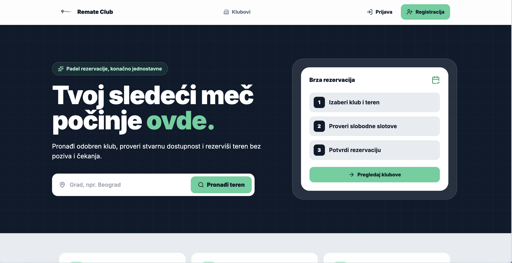
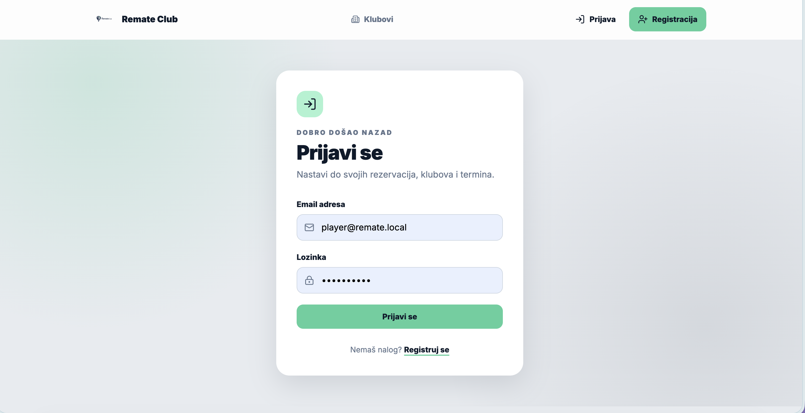
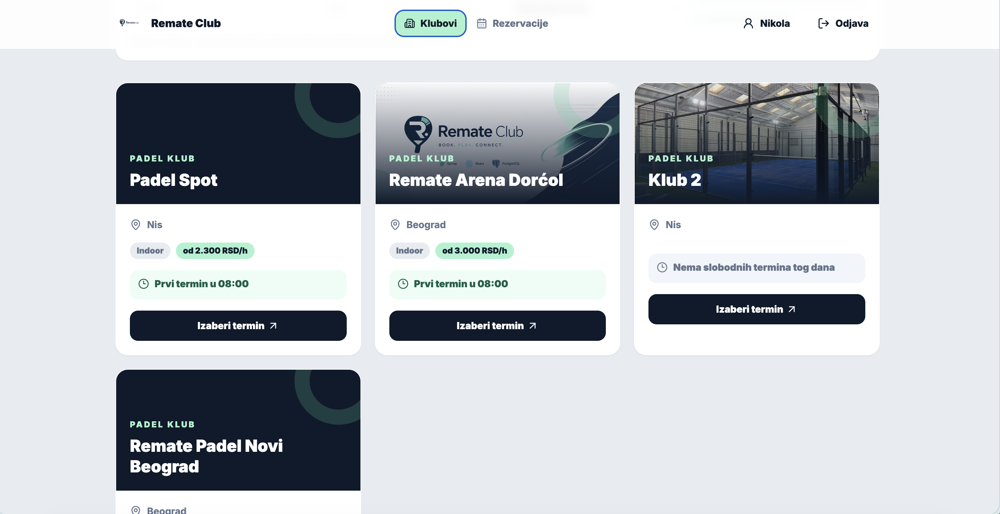
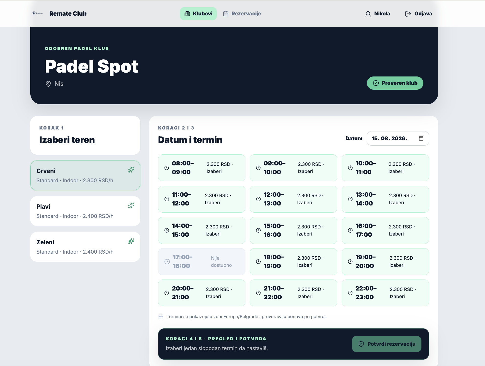
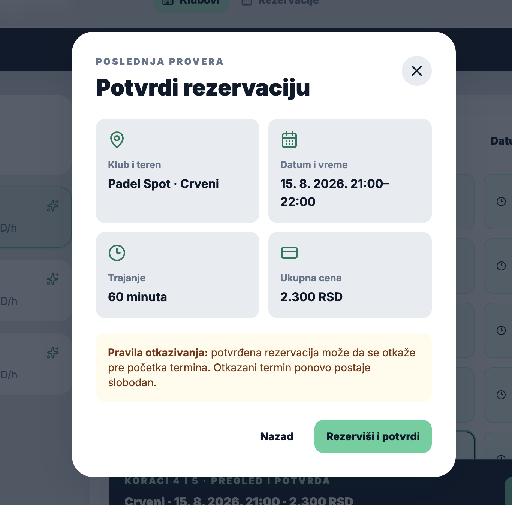
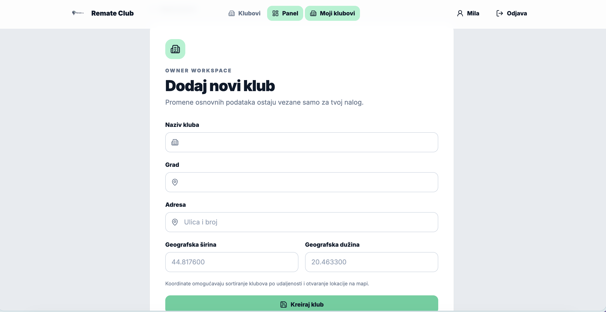

<p align="center">
  
</p>

# Remate Club

Remate Club je full-stack platforma za pronalaženje padel klubova, proveru slobodnih termina i rezervaciju terena. Aplikacija ima odvojene tokove za igrače, vlasnike klubova i administratore, dok backend kontroliše cenu, dostupnost, ownership i zaštitu od duplog bookinga.

## Šta trenutno radi

- Javni landing i napredna pretraga po datumu, gradu, ceni, indoor/outdoor okruženju, dostupnosti, oceni i udaljenosti; filteri ostaju u URL-u.
- Kartice klubova prikazuju cover, ocenu, početnu cenu i najraniji slobodan termin za izabrani datum.
- Pregled terena, cena i slobodnih termina sa sticky rezimeom, potvrdom i posebnim success ekranom.
- Registracija i prijava za `PLAYER` i `OWNER` naloge.
- JWT access token i rotirajući refresh token.
- Igrač kreira, pregleda, pomera i otkazuje rezervacije, dodaje ih u kalendar i otvara lokaciju kluba.
- Vlasnik kreira i uređuje klubove i terene i prati rezervacije.
- Vlasnik dodaje do osam fotografija, bira cover sliku i briše fotografije kluba.
- Administrator pregleda, odobrava i odbija klubove na čekanju.
- Backend računa cenu, zaključava teren i sprečava booking overlap.
- PostgreSQL šema je u potpunosti vođena Flyway migracijama.

## Screenshots

<table>
  <tr>
    <td width="50%" align="center">
      
      <br /><strong>Landing stranica</strong>
    </td>
    <td width="50%" align="center">
      
      <br /><strong>Prijava korisnika</strong>
    </td>
  </tr>
  <tr>
    <td width="50%" align="center">
      
      <br /><strong>Klubovi i slobodni termini</strong>
    </td>
    <td width="50%" align="center">
      
      <br /><strong>Izbor terena i termina</strong>
    </td>
  </tr>
  <tr>
    <td width="50%" align="center">
      
      <br /><strong>Potvrda rezervacije</strong>
    </td>
    <td width="50%" align="center">
      
      <br /><strong>Dodavanje novog kluba</strong>
    </td>
  </tr>
</table>

## Tehnologije

| Sloj | Tehnologije |
| --- | --- |
| Frontend | React 19, TypeScript, Vite, React Router, TanStack Query, Axios, Tailwind CSS |
| Backend | Java 21, Spring Boot 3.5, Spring Security, Spring Data JPA, Bean Validation |
| Baza | PostgreSQL 16, Flyway |
| Auth | BCrypt, JWT access token, rotirajući refresh token |
| Testovi | JUnit, Mockito, Testcontainers, Vitest, Testing Library |
| Lokalno okruženje | Docker Compose, Nginx |

## Najbrže pokretanje — Docker

Potrebni su samo Docker Desktop i slobodni portovi.

```bash
cp .env.example .env
docker compose up -d --build
```

Otvori:

- Frontend: <http://localhost:5173>
- Backend health: <http://localhost:8080/api/health>
- Swagger UI: <http://localhost:8080/swagger-ui.html>
- OpenAPI JSON: <http://localhost:8080/v3/api-docs>

Ako su `5173` ili `5432` zauzeti:

```bash
FRONTEND_PORT=5174 POSTGRES_PORT=5433 docker compose up -d --build
```

Tada je frontend na <http://localhost:5174>. Za logove i gašenje:

```bash
docker compose logs -f
docker compose down
```

Podaci ostaju u Docker volumenu. Potpuno brisanje lokalne baze je namerna, destruktivna operacija i radi se samo komandom `docker compose down -v`.

## Razvojni nalozi

Docker Compose podrazumevano uključuje Spring profil `dev`. Seeder je idempotentan i kreira sledeće naloge samo u tom profilu:

| Uloga | Email | Lozinka | Početni ekran |
| --- | --- | --- | --- |
| Igrač | `player@remate.local` | `Remate123!` | `/bookings` |
| Vlasnik | `owner@remate.local` | `Remate123!` | `/owner` |
| Administrator | `admin@remate.local` | `Remate123!` | `/admin/clubs/pending` |

Seed uključuje i odobren klub **Remate Arena Dorćol**, dva aktivna terena i jedan klub koji čeka admin odluku. Profil `dev` nikada ne uključivati u produkciji.

## Lokalno pokretanje bez Docker frontend/backend kontejnera

### 1. PostgreSQL

```bash
docker compose up -d postgres
```

### 2. Backend

Potrebni su Java 21 i Maven:

```bash
cd backend
SPRING_PROFILES_ACTIVE=dev mvn spring-boot:run
```

Ako je PostgreSQL mapiran na `5433`:

```bash
SPRING_PROFILES_ACTIVE=dev \
SPRING_DATASOURCE_URL=jdbc:postgresql://localhost:5433/remate_club \
mvn spring-boot:run
```

### 3. Frontend

Potrebni su Node.js 20.19+ i npm:

```bash
cd frontend
npm ci
npm run dev
```

Frontend koristi `VITE_API_BASE_URL` iz [frontend/.env.example](frontend/.env.example), a backend promenljive su opisane u [backend/.env.example](backend/.env.example).

## Kako proći kroz aplikaciju

### Javni deo

1. Otvori `/` i unesi grad u hero pretragu.
2. Na `/clubs` izaberi datum i filtriraj po gradu, indoor/outdoor terenu, ceni ili opciji **Slobodno danas**. Filteri se mogu podeliti kopiranjem URL-a.
3. Za sortiranje po udaljenosti dozvoli pristup lokaciji preko dugmeta **Koristi moju lokaciju**.
4. Kartica prikazuje najraniji slobodan termin; otvori `/clubs/{clubId}` i izaberi teren, datum i slot.
5. Slobodni slot prikazuje backend cenu; zauzeti ili blokirani slot je onemogućen.

### Igrač

1. Prijavi se kao `player@remate.local` ili registruj novi PLAYER nalog.
2. Izaberi slobodan termin na detaljima kluba, proveri rezime i potvrdi rezervaciju u modalu.
3. Posle uspeha otvara se potvrda sa cenom i prečicom ka detaljima rezervacije.
4. `/bookings` deli rezervacije na predstojeće, završene i otkazane i nudi detalje, otkazivanje, promenu termina, kalendar i mapu.
5. `/profile` prikazuje identitet, status i prečicu ka rezervacijama.

### Vlasnik

1. Prijavi se kao `owner@remate.local`.
2. `/owner` prikazuje KPI pregled i brze akcije.
3. `/owner/clubs` prikazuje klubove; novi klub ulazi u `PENDING_APPROVAL`.
4. Editor menja naziv, grad, adresu i koordinate, a ekran terena dodaje/menja tip, indoor/outdoor okruženje, cenu i aktivnost.
5. `/owner/reservations` prikazuje rezervacije svih vlasnikovih klubova.

### Administrator

1. Prijavi se kao `admin@remate.local`.
2. Otvori `/admin/clubs/pending`.
3. Odobri klub da postane javan ili ga odbij. Lista se automatski osvežava.

## Testovi i build

```bash
cd backend
mvn test
```

Backend integracioni testovi koriste PostgreSQL 16 kroz Testcontainers, pa Docker mora biti pokrenut.

```bash
cd frontend
npm test -- --run
npm run typecheck
npm run build
```

## Dokumentacija

- [API endpointi](docs/api-endpoints.md) — implementirane rute, pristup i namena.
- [Arhitektura](docs/architecture.md) — moduli, bezbednosna pravila i booking tok.
- [Komande za pokretanje](docs/run-commands.md) — Docker, backend, frontend i testovi.
- [Status implementacije](docs/implementation-plan.md) — završen MVP i naredne iteracije.

Interaktivni API ugovor dostupan je kroz Swagger UI dok backend radi.

## Dodavanje slika kluba

Vlasnik otvara **Moji klubovi → Uredi → Fotografije**, bira fajl, upisuje kratak opis i po želji označava sliku kao cover. Prva dodata slika automatski postaje cover. Klub može imati najviše osam slika, a posle uploada cover može da se promeni ili slika obriše.

| Namena | Preporučena rezolucija | Odnos | Format |
| --- | --- | --- | --- |
| Cover kluba | `1600 × 900 px` | 16:9 | WebP ili JPEG |
| Galerija | `1600 × 1200 px` | 4:3 | WebP ili JPEG |
| Logo sa providnom pozadinom | `800 × 800 px` | 1:1 | PNG |

Pravila uploada:

- podržani su JPEG, PNG i WebP;
- WebP je preporučen za fotografije jer daje dobar kvalitet uz manji fajl;
- minimalna rezolucija je `600 × 400 px`, maksimalna `6000 × 6000 px`;
- maksimalna veličina je 5 MB po slici;
- HEIC/HEIF fotografije sa telefona prvo treba izvesti kao WebP ili JPEG;
- opis slike je obavezan i služi kao `alt` tekst za pristupačnost;
- server proverava stvarni format i dimenzije, a ne samo ekstenziju fajla.

U Docker okruženju fajlovi se trajno čuvaju u volumenu `club_images`, dok PostgreSQL čuva metapodatke i bezbedan UUID storage ključ. Za produkciju je preporučena zamena lokalnog direktorijuma S3/Cloudinary/R2 skladištem i CDN-om; API i UI mogu ostati isti.

Dodatni vizuelni koraci koji još imaju smisla su landing hero fotografija, mapa/lokacija, avatar ili logo kluba, Open Graph slika i empty-state ilustracije.

## Struktura

```text
backend/                  Spring Boot API
frontend/                 React/Vite aplikacija
docs/                     Arhitektura, API i run dokumentacija
assets/branding/          Logo i banneri za javni README
assets/screenshots/       Screenshotovi glavnih korisničkih tokova
docker-compose.yml        Lokalni full-stack runtime
```
