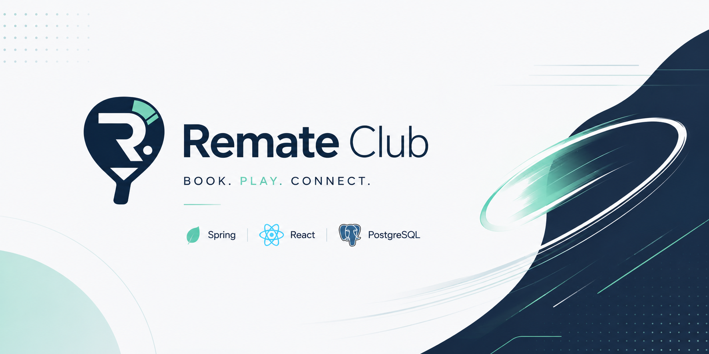
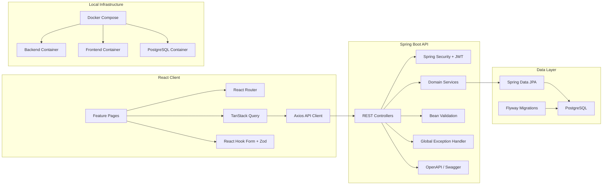

<p align="center">
  
</p>

<p align="center">
  <a href="#"></a>
  <a href="#"></a>
  <a href="#"></a>
  <a href="#"></a>
  <a href="#"></a>
  <a href="#"></a>
  <a href="#"></a>
  <a href="#"></a>
  <a href="#"></a>
  <a href="#"></a>
  <a href="#"></a>
  <a href="#"></a>
  <a href="#"></a>
  <a href="#"></a>
</p>

# Remate Club

Remate Club is a full-stack padel court reservation platform for players, club owners, and administrators. It helps players discover clubs, review available courts and time slots, and create reservations through a clear, role-aware booking flow.

The project is built as a full-stack monorepo: a React + TypeScript frontend for the user experience, a Spring Boot API for business logic and security, and PostgreSQL as the persistent data layer.

> Current implementation note: the project foundation is in place and Phase 2 is focused on authentication, users, security, API error handling, and database migrations before expanding into clubs, courts, and bookings.

## Product Vision

Remate Club aims to make padel reservations easier for players and more manageable for club owners. The long-term goal is a reliable reservation system where availability, ownership, approvals, and booking rules are enforced by the backend instead of trusted to the client.

The platform is designed around four core ideas:

- **Fast court discovery**: players should quickly find clubs, courts, and available time slots.
- **Reliable booking rules**: reservation conflicts, blocked court periods, and pricing are controlled server-side.
- **Role-based workflows**: players, owners, and admins get separate permissions and views.
- **Clean local development**: Docker Compose, PostgreSQL, Flyway, and OpenAPI keep the development loop predictable.

## Application Modules

| Area | Purpose |
| --- | --- |
| Authentication | Player and owner registration, login, refresh tokens, JWT sessions, and current-user context. |
| Users | User identity, role, status, password hashing, and account lifecycle rules. |
| Clubs | Public club discovery, owner-managed club profiles, and admin approval flow. |
| Courts | Court inventory, court type, active status, and club ownership relationships. |
| Availability | Date-based slot calculation using bookings and owner-defined court blocks. |
| Bookings | Reservation creation, conflict detection, cancellation rules, and booking history. |
| Admin | Club approval, rejection, moderation, and elevated operational access. |
| API Documentation | Swagger/OpenAPI documentation for testing and documenting backend endpoints. |

## Architecture



### Frontend

The frontend is a React application organized around pages, reusable UI components, routing, API access, and shared styles.

Key frontend choices:

- **React 19** for the web application UI.
- **Vite** for fast local development and production builds.
- **TypeScript** for stronger frontend contracts.
- **React Router** for route structure and future protected routes.
- **TanStack Query** for server-state fetching and caching.
- **Axios** for backend HTTP communication.
- **React Hook Form + Zod** for form state and validation.
- **Tailwind CSS** for the Remate Club visual system.

### Backend

The backend is a modular Spring Boot API prepared for authentication, role-aware access control, validation, database migrations, and OpenAPI documentation.

Key backend choices:

- **Java 21** as the backend runtime target.
- **Spring Boot 3.5.x** for the API foundation.
- **Spring Web** for REST endpoints.
- **Spring Security** for stateless security and future JWT authentication.
- **Spring Data JPA** for relational persistence.
- **Bean Validation** for request validation.
- **Flyway** for versioned database migrations.
- **Springdoc OpenAPI** for Swagger UI and API contracts.

### Database

PostgreSQL is the source of truth for users, roles, clubs, courts, bookings, court blocks, refresh tokens, and future audit-friendly reservation data. The schema is intended to evolve through Flyway migrations, while Hibernate runs in validation mode so the database remains migration-driven.

## Repository Structure

```text
remate-club/
  backend/
    src/main/java/com/remateclub/
      auth/                 # Authentication module
      user/                 # User domain
      club/                 # Club domain
      court/                # Court domain
      booking/              # Booking domain
      availability/         # Availability domain
      common/               # Shared config, responses, exceptions, health
      security/             # Spring Security configuration
    src/main/resources/
      db/migration/         # Flyway migrations
      application.yml       # Backend configuration
  frontend/
    src/
      components/           # Reusable UI components
      layout/               # App layout
      pages/                # Landing, auth, error pages
      routes/               # React Router setup
      services/             # API client
      styles/               # Tailwind entry styles
  assets/
    notion/                 # Planning exports and task tracking
  Asstets/                  # Branding images used by GitHub README
  docker-compose.yml        # Local full-stack runtime
```

## Getting Started

### Prerequisites

- Docker Desktop
- Java 21
- Maven
- Node.js 20+ or 22+
- npm

### Environment

Copy the example environment file before local development:

```bash
cp .env.example .env
```

Do not commit real secrets.

### Run With Docker

```bash
docker compose up --build
```

Default service URLs:

- Frontend: http://localhost:5173
- Backend: http://localhost:8080
- Swagger UI: http://localhost:8080/swagger-ui.html
- OpenAPI JSON: http://localhost:8080/v3/api-docs
- PostgreSQL: localhost:5432

If local ports are already occupied, override them for the current run:

```bash
FRONTEND_PORT=5174 POSTGRES_PORT=5433 docker compose up -d --build
```

### Backend

```bash
cd backend
mvn spring-boot:run
```

Health check:

```bash
curl http://localhost:8080/api/health
```

Run backend tests:

```bash
cd backend
mvn test
```

### Frontend

```bash
cd frontend
npm install
npm run dev
```

Run frontend checks:

```bash
cd frontend
npm run typecheck
npm run build
npm test
```

## Current Status

Implemented or scaffolded:

- Monorepo structure with backend, frontend, assets, and planning exports.
- Docker Compose stack for PostgreSQL, backend, and frontend.
- Local PostgreSQL container with persistent volume and healthcheck.
- Spring Boot backend foundation with Java 21, Maven, Security, JPA, Flyway, PostgreSQL driver, and Swagger/OpenAPI.
- Backend health endpoint at `/api/health`.
- React + Vite + TypeScript frontend foundation.
- Landing, login, registration, and not-found pages.
- Shared frontend button component, app layout, router setup, API client, Tailwind configuration, and tests.
- Root README, `.gitignore`, `.env.example`, backend env example, and frontend env example.

Next priorities:

- Add global exception handler with consistent JSON errors.
- Add user entity, role/status enums, and Flyway users migration.
- Implement register, login, refresh, and current-user endpoints.
- Add BCrypt password hashing and JWT access tokens.
- Add refresh token persistence and revocation-ready session model.
- Build protected frontend auth flow connected to backend endpoints.

<br />

<p align="center">
  
</p>

<p align="center">
  <strong>Remate Club helps players find courts faster, clubs manage availability better, and reservations stay reliable from the first click to match time.</strong>
</p>
